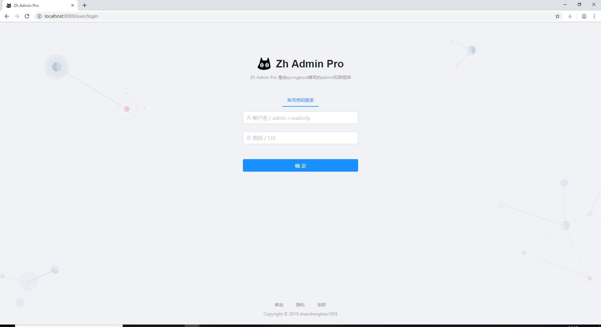
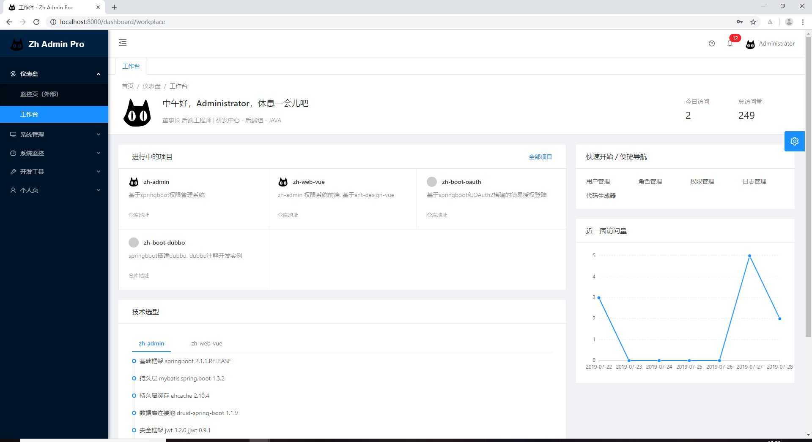
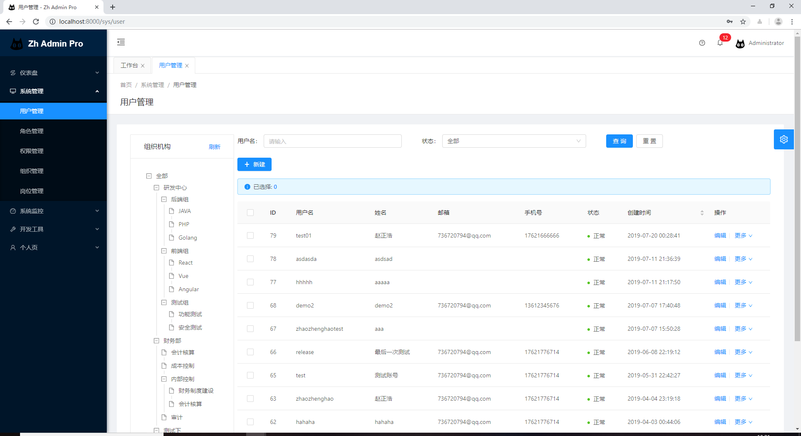
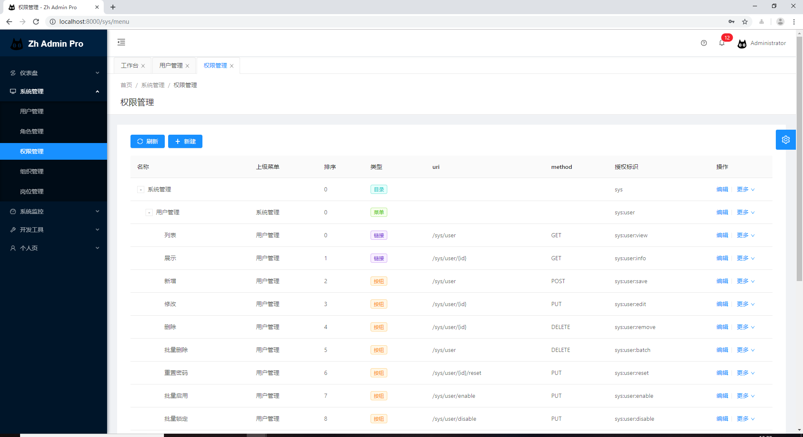
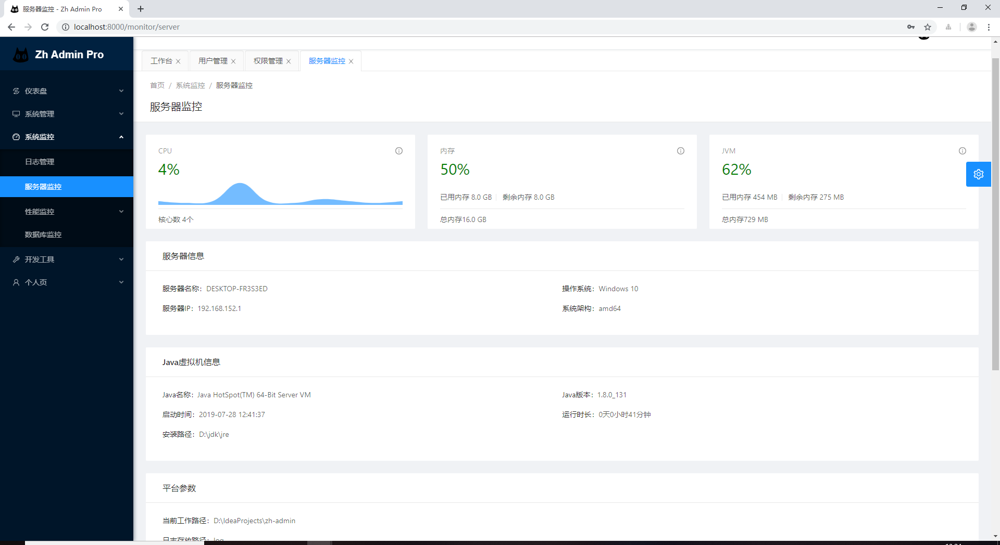
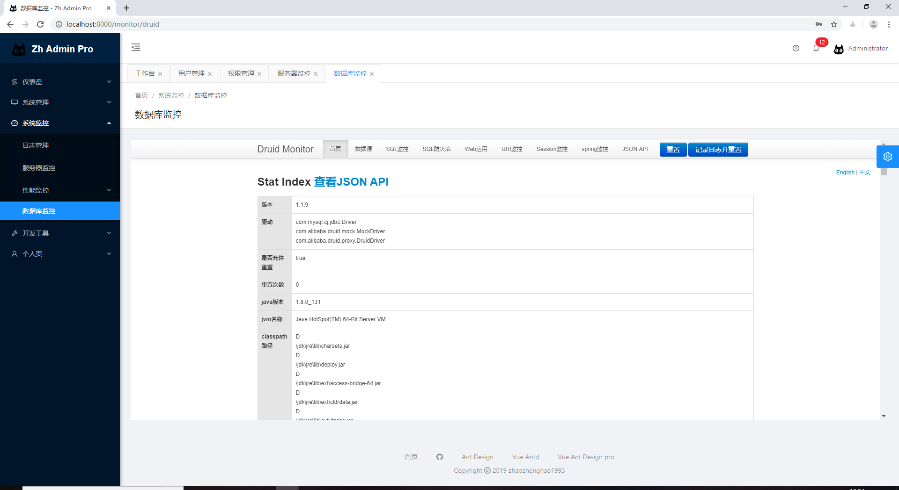
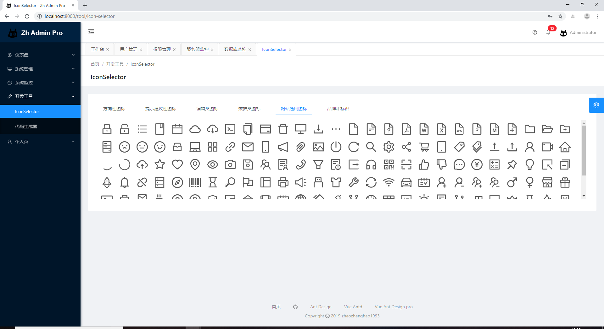
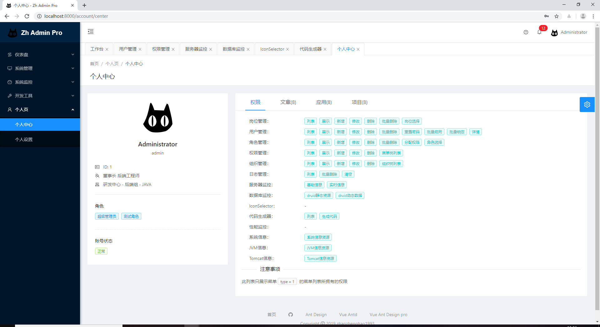
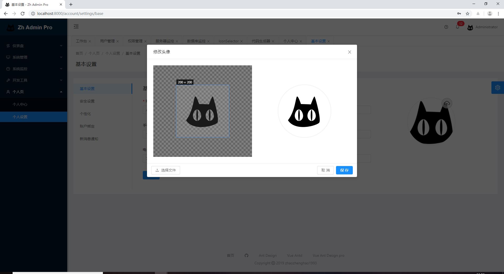

<p align="center">
  <a href="#">
    
  </a>
</p>

<h1 align="center">zh-web-vue</h1>

<div align="center">

zh-admin 的前端框架.

[](https://github.com/zhaozhenghao1993/zh-web-vue/releases)
[](https://www.travis-ci.org/zhaozhenghao1993/zh-web-vue)

</div>

## 项目介绍

zh-web-vue 是 zh-admin 的前端框架。采用前后端分离，代码简单，方便二次开发，包含鉴权管理、服务器监控、代码生成器、个人自定义主题等模块，拿来即用，降低繁杂的开发成本。

前端动态生成路由，权限控制精确到每个路由页面，每个操作按钮。

## 后端地址

[zh-admin](https://github.com/zhaozhenghao1993/zh-admin)

## 演示环境

[http://106.12.21.222](http://106.12.21.222)

## 技术选型

#### 后端

- 基础框架 springboot 2.1.1.RELEASE
- 持久层 mybatis.spring.boot 1.3.2
- 持久层缓存 ehcache 2.10.4
- 数据库连接池 druid-spring-boot 1.1.9
- 安全框架 jwt 3.2.0 jjwt 0.9.1
- 分页 pagehelper 1.2.5
- 摸板引擎 velocity 1.7

#### 前端

- vue
- vuex
- axios
- @vue/cli ~3
- [ant-design-vue](https://github.com/vueComponent/ant-design-vue)
- [ant-design-vue-pro](https://github.com/sendya/ant-design-pro-vue) - 脚手架
- [vue-cropper](https://github.com/xyxiao001/vue-cropper) - 头像裁剪组件
- [@antv/g2](https://antv.alipay.com/zh-cn/index.html) - Alipay AntV 数据可视化图表
- [Viser-vue](https://viserjs.github.io/docs.html#/viser/guide/installation) - antv/g2 封装实现

由于使用 ant-design-vue 和 ant-design-vue-pro，开发文档可参照

https://vue.ant.design/docs/vue/introduce-cn/

https://pro.loacg.com/docs/getting-started

## 项目模块

```
├─仪表盘
│  └─工作台
├─系统管理
│  ├─用户管理
│  ├─角色管理
│  ├─权限管理
│  ├─部门管理
│  └─岗位管理
├─系统监控
│  ├─日志管理
│  ├─服务器监控
│  ├─性能监控
│  │  ├─服务器信息
│  │  ├─jvm信息
│  │  └─Tomcat信息
│  └─数据库监控
│─开发工具
│  ├─IconSelector
│  └─代码生成器
│─个人页
└─ ├─个人中心
   └─个人设置
      ├─基本设置
      ├─安全设置
      └─个性化设置
```

```
├── docker
│   └── build.sh             # 构建镜像脚本
│   └── start.sh             # 启动镜像脚本
|   └── nginx.conf           # nginx配置
├── public
│   └── logo.png             # LOGO
|   └── index.html           # Vue 入口模板
├── src
│   ├── api                  # Api ajax 等
│   ├── assets               # 本地静态资源
│   ├── config               # 项目基础配置，包含路由，全局设置
│   ├── components           # 业务通用组件
│   ├── core                 # 项目引导, 全局配置初始化，依赖包引入等
│   ├── router               # Vue-Router
│   ├── store                # Vuex
│   ├── utils                # 工具库
│   ├── locales              # 国际化资源
│   ├── views                # 业务页面入口和常用模板
│   ├── App.vue              # Vue 模板入口
│   └── main.js              # Vue 入口 JS
│   └── permission.js        # 路由守卫(路由权限控制)
├── tests                    # 测试工具
├── README.md
└── package.json
```

## 快速开始

#### 拉取项目代码

```
git clone https://github.com/zhaozhenghao1993/zh-web-vue.git
cd zh-web-vue
```

#### 安装依赖

```
yarn install
```

#### 开发模式运行

```
yarn run serve
```

#### 编译项目

```
yarn run build
```

#### Lints and fixes files

```
yarn run lint
```

#### 后端项目编译

请查看 [zh-admin](https://github.com/zhaozhenghao1993/zh-admin)

## docker镜像

```
docker pull zhaozhenghao1993/zh-web-vue

docker run -p 8000:80 -v /root/Projects/zh-web-vue/docker/nginx.conf:/etc/nginx/conf.d/default.conf --name zh-web-vue -d zhaozhenghao1993/zh-web-vue:1.0.1
```

## 系统展示

















